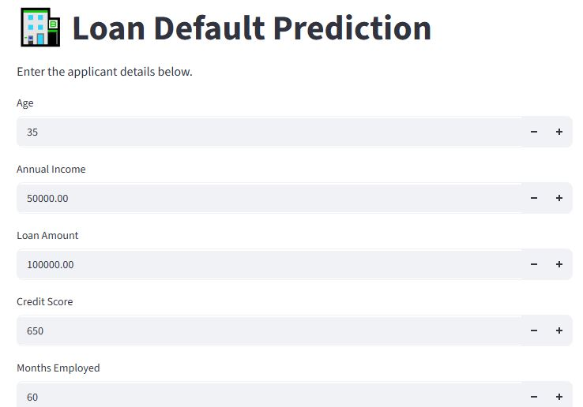
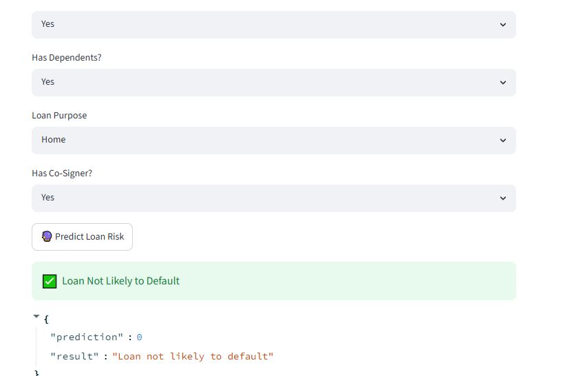

# 🚀 Loan Default Risk Prediction using Machine Learning


## 📌 Overview

Loan default is one of the major financial risks faced by banks and lending institutions. This project uses Machine Learning to predict whether a loan applicant is likely to default based on customer information.

The project demonstrates an end-to-end Machine Learning workflow, from data preprocessing and model training to deployment using FastAPI and Streamlit.

---

## 🎯 Problem Statement

Financial institutions need to assess the risk of loan default before approving loans.

Traditional manual assessment is often slow and inconsistent.

This project provides an AI-powered prediction system that helps estimate the likelihood of loan default using historical customer data.

---

## ✨ Features

- Predict loan default risk
- FastAPI REST API
- Streamlit interactive web application
- Trained Machine Learning model
- Saved preprocessing pipeline
- Easy deployment

---

## 🛠 Technologies Used

- Python
- Pandas
- NumPy
- Scikit-Learn
- Joblib
- FastAPI
- Streamlit
- Uvicorn

---

## 📂 Project Structure

```
loan-default-risk-analysis/
│
├── app.py
├── streamlit_app.py
├── requirements.txt
├── render.yaml
├── README.md
├── .gitignore
│
├── models/
│   ├── loan_default_model.joblib
│   └── label_encoders.joblib
│
├── notebooks/
│   └── loan_default_model_training.ipynb
│
├── images/
│   ├── homepage.JPG
│   └── prediction_result.JPG
│
└── data/
```

---

## ⚙️ Machine Learning Workflow

1. Data Collection
2. Data Cleaning
3. Exploratory Data Analysis
4. Feature Engineering
5. Data Preprocessing
6. Model Training
7. Model Evaluation
8. Model Serialization
9. API Development using FastAPI
10. Streamlit Frontend
11. Deployment

---

## 🧠 Machine Learning Model

The trained model predicts whether a customer is likely to default on a loan.

The preprocessing pipeline includes:

- Label Encoding
- Feature Transformation
- Model Serialization using Joblib

---
## 📊 Model Performance

| Metric | Value |
|---------|------:|
| Accuracy | 83.08% |
| Precision | 24.93% |
| Recall | 22.71% |
| F1 Score | 23.77% |

The model was trained using Random Forest with SMOTE to address class imbalance. Since loan default prediction is an imbalanced classification problem, evaluation focused on precision, recall, and F1-score rather than accuracy alone.

## 🌐 API

Run the FastAPI backend:

```bash
uvicorn app:app --reload
```

API Documentation:

```
http://127.0.0.1:8000/docs
```

---

## 💻 Streamlit App

Launch the frontend:

```bash
streamlit run streamlit_app.py
```

---

## 📸 Screenshots

### Home Page



### Prediction Result



---

## 🚀 Installation

Clone the repository

```bash
git clone https://github.com/Funbi-data/loan-default-risk-analysis.git
```

Navigate into the project

```bash
cd loan-default-risk-analysis
```

Install dependencies

```bash
pip install -r requirements.txt
```

---

## 🔮 Future Improvements

- Hyperparameter tuning
- Explainable AI using SHAP
- Model monitoring
- Docker containerization
- CI/CD with GitHub Actions
- Cloud deployment using AWS

---

## 👨‍💻 Author

**Funbi Opemipo Olowojesiku**

AI Engineer | Machine Learning Engineer | Data Analyst

GitHub:
https://github.com/Funbi-data

LinkedIn:
https://www.linkedin.com/in/funbiolowojesiku/

---

## ⭐ Support

If you found this project useful, please consider giving it a ⭐ on GitHub.